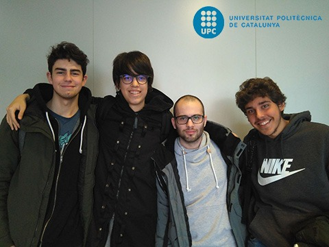

Game description
-
A Mini Game named SnowyDays that it's based on the Mlg art and as a lot of references to Mario 64 and Mario Galaxy, two big games!

Development team
-
Our team consists of four members:

- Lluís Moreu as the manager.
- Marc Gálvez as the programmer.
- Marc Navas as the artist.
- Christian Martínez as the QA.

Currently we are studying VideoGames Design and Development at the "Centre de la Imatge i Multimèdia" (CITM) in Terrassa, Catalonia, Spain. This is our first project in this degree. This project consists of choosing an arcade game and program it from the beggining, so the whole group is going to program the game but we had to take some responsabilities that were given to each of the group.
This game is part of this big project, we made it in order to practise with SDL libraries.

Original gameplay
-

There's no gameplay video yet.
